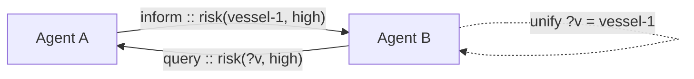

# agentlex

**A symbolic agent-to-agent language** — so AI agents say things to each other
*precisely* (speech acts + unifiable symbolic terms), instead of trading ambiguous
natural-language strings.



Most "multi-agent" systems pass free-text prompts between agents and hope for the
best. agentlex gives them a tiny, typed **communication language**: a message is a
**speech act** (the *intent* — inform / request / query / propose / agree / refuse)
carrying a **symbolic term** (the *content*). Terms unify — so one agent's query
pattern `risk(?v, high)` matches another's fact `risk(vessel-1, high)` and binds the
variable. This is the lesson of the classic agent communication languages (KQML,
FIPA-ACL) and symbolic AI, kept small and modern.

Pure standard library. Drops onto any transport — an [edgemesh](https://github.com/cognis-digital/edgemesh)
`/v1` stream, MCP, a queue, a socket.

<!-- cognis:domains:start -->

<!-- cognis:example:start -->
## 🔎 Example output

Real, reproducible output from the tool — runs offline:

```console
$ agentlex-emit --help
usage: agentlex-emit [-h]
                     --to {stix,taxii,misp,sigma,splunk,elastic,slack,discord,webhook,brief,findings}
                     [--url URL] [--token TOKEN] [--dry-run]
                     [input]

forward agentlex JSON findings to a platform via cognis-connect

positional arguments:
  input                 findings JSON file (default: stdin)

options:
  -h, --help            show this help message and exit
  --to {stix,taxii,misp,sigma,splunk,elastic,slack,discord,webhook,brief,findings}
  --url URL
  --token TOKEN
  --dry-run
```

> Blocks above are real `agentlex` output — reproduce them from a clone.

**Sample result format** _(illustrative values — run on your own data for real findings):_

```
{
"Findings": [
    {
        "id": "1234567890",
        "title": "Suspicious Network Traffic",
        "description": "Potential malicious activity detected on port 443.",
        "categories": ["Network", "Malware"],
        "created_at": "2023-02-20T14:30:00Z"
    },
    {
        "id": "2345678901",
        "title": "Unusual File Access",
        "description": "An unknown process accessed a sensitive file.",
        "categories": ["File", "Privilege Escalation"],
        "created_at": "2023-02-20T14:35:00Z"
    }
]
}
```

<!-- cognis:example:end -->

## Domains

**Primary domain:** AI & ML  ·  **JTF MERIDIAN division:** ATHENA-PRIME · SAGE

**Topics:** `cognis` `ai` `llm` `machine-learning` `agent-security` `python`

Part of the **Cognis Neural Suite** — 300+ source-available tools organized across 12 domains under the JTF MERIDIAN command structure. See the [suite on GitHub](https://github.com/cognis-digital) and [jtf-meridian](https://github.com/cognis-digital/jtf-meridian) for how the pieces fit together.
<!-- cognis:domains:end -->

## Install & try

```bash
pip install "git+https://github.com/cognis-digital/agentlex.git"
agentlex demo
agentlex parse "sighted(?vessel, location(36.42, 22.96))"
agentlex unify "risk(?v, high)" "risk(vessel-1, high)"     # -> ?v = vessel-1
agentlex msg   "inform from:scout to:command conv:c1 :: risk(vessel-9, high)"
```

## Library

```python
from agentlex import Message, parse_term, unify, substitute, from_wire

m = Message("inform", "scout", "command", parse_term("risk(vessel-9, high)"), conversation="c1")
wire = m.to_wire()                       # send over any transport
fact = from_wire(wire)                   # the receiver parses it

pattern = parse_term("risk(?v, high)")   # "which vessel is high-risk?"
s = unify(pattern, fact.content)
print(substitute(parse_term("?v"), s))   # Symbol('vessel-9')
```

## Reason over what you're told

Speaking is half of it — agents also need to *reason* over what they hear. The
`KnowledgeBase` stores the content of `inform` messages and answers queries by
unification, including **conjunctive (joined) queries** and **forward-chaining rules**:

```python
from agentlex import KnowledgeBase, parse_term

kb = KnowledgeBase()
for f in ["risk(vessel-1, high)", "location(vessel-1, hormuz)", "chokepoint(hormuz)"]:
    kb.assert_fact(parse_term(f))

# join on a shared variable: a high-risk vessel AND where it is
kb.query([parse_term("risk(?v, high)"), parse_term("location(?v, ?where)")])
# -> [{v: vessel-1, where: hormuz}]

# a rule: high-risk + sitting in a chokepoint => watchlist it
kb.add_rule(parse_term("watchlist(?v)"),
            [parse_term("risk(?v, high)"), parse_term("location(?v, ?c)"), parse_term("chokepoint(?c)")])
kb.infer()                       # -> [watchlist(vessel-1)]
```

`agentlex reason` runs this end-to-end.

## What's in the box

- **`terms.py`** — `Symbol` / `Var` / `Literal` / `Compound`, with first-order
  **unification** (occurs-check) and substitution — the symbolic-AI substrate.
- **`parse.py`** — recursive-descent parser for the compact term syntax.
- **`message.py`** — speech-act messages (FIPA-ACL-style performatives), a one-line
  human-readable wire form, and JSON.
- **`cli.py`** — `parse` / `unify` / `msg` / `demo`.

## Designed to interop

- [`humind`](https://github.com/cognis-digital/humind) — its companion: a cognitive
  NL context engine that **emits** agentlex messages from extracted intent and
  **ingests** them into memory. Together: language ↔ understanding.
- [`agentmap`](https://github.com/cognis-digital/agentmap) — map agent-to-agent / MCP
  communications · [`agentsmith`](https://github.com/cognis-digital/agentsmith) —
  orchestrate multi-agent workflows · [`engram`](https://github.com/cognis-digital/engram) —
  durable agent memory · [`edgemesh`](https://github.com/cognis-digital/edgemesh) — transport.

## Integrations

Forward `agentlex`'s findings to STIX/MISP/Sigma/Splunk/Elastic/Slack/webhooks via
[`cognis-connect`](https://github.com/cognis-digital/cognis-connect). See **[INTEGRATIONS.md](INTEGRATIONS.md)**.

## License
Cognis Open Collaboration License (COCL) 1.0 — see [LICENSE](LICENSE).

---
📡 **[Interop map](INTEROP.md)** — how this repo composes with the rest of the Cognis suite (private-AI backbone, agent language + cognition, domain intelligence).
